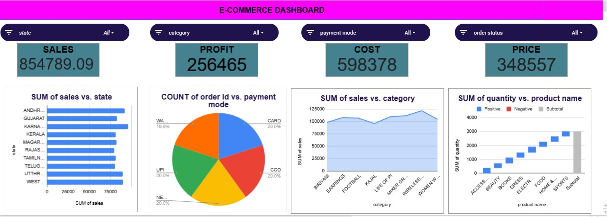

 E-Commerce Sales Dashboard (Excel)

 
 Dashboard Preview

 
 
 Project Overview
This project is an interactive E-Commerce Sales Dashboard developed using Microsoft Excel. It provides insights into sales performance, profit, cost, product categories, payment methods, and state-wise sales using interactive charts and filters.
The dashboard helps users analyze business performance and make data-driven decisions through easy-to-understand visualizations.

 Features
 Total Sales Analysis
 Profit Analysis
 Cost & Price Overview
 State-wise Sales Performance
 Category-wise Sales Analysis
 Payment Mode Distribution
 Product-wise Quantity Analysis
 
  Interactive Filters
State
Category
Payment Mode
Order Status

Tools Used
Microsoft Excel
Pivot Tables
Pivot Charts
Slicers
Data Cleaning
Dashboard Design

Project Files
ecommerce_dashboard.xlsx
ecommerce_dashboard.jpg

key Metrics
Total Sales: 854,789.09
Total Profit: 256,465
Total Cost: 598,378
Total Price: 348,557

Author
SRIVITHYA.M
